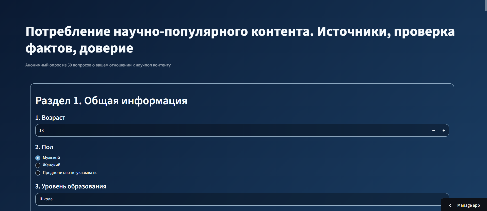

# Popular Science Survey


# Popular Science Survey

Веб-приложение для проведения социологического опроса на тему **«Потребление научно-популярного контента: источники, проверка фактов и доверие»**.

Приложение разработано в рамках учебной практики и предназначено для проведения онлайн-анкетирования, хранения результатов в облачной базе данных Firebase Firestore и автоматического анализа полученных данных.

---



## Возможности

- проведение онлайн-опроса из **50 вопросов**;
- современный адаптивный интерфейс на Streamlit;
- автоматическое сохранение результатов в Firebase Firestore;
- просмотр первых записей базы данных;
- построение аналитических диаграмм;
- расчет средних показателей;
- экспорт результатов в CSV;
- публикация приложения в Streamlit Cloud.

---

## Используемые технологии

| Технология | Назначение |
|------------|------------|
| Python | основной язык программирования |
| Streamlit | пользовательский интерфейс |
| Firebase Firestore | облачная база данных |
| Firebase Admin SDK | подключение к Firebase |
| Pandas | обработка данных |
| Plotly Express | визуализация результатов |
| Git | контроль версий |
| GitHub | хранение исходного кода |
| Streamlit Cloud | публикация приложения |

---

## Структура проекта

```text
survey_app/
│
├── app.py                     # Основной файл приложения
├── requirements.txt           # Зависимости проекта
├── README.md                  # Документация
├── .gitignore                 # Игнорируемые Git файлы
├── serviceAccountKey.json     # Ключ Firebase (локальный запуск)
└── .streamlit/
      └── config.toml          # Настройки темы Streamlit
```

---

## Установка

### 1. Клонировать репозиторий

```bash
git clone https://github.com/ya-plita/Popular-science-survey.git
cd Popular-science-survey
```

### 2. Создать виртуальное окружение

Windows

```bash
python -m venv venv
venv\Scripts\activate
```

Linux / macOS

```bash
python3 -m venv venv
source venv/bin/activate
```

### 3. Установить зависимости

```bash
pip install -r requirements.txt
```

---

## Настройка Firebase

Для локального запуска необходимо получить сервисный ключ Firebase.

В корне проекта должен находиться файл

```text
serviceAccountKey.json
```

Для публикации в Streamlit Cloud необходимо добавить все параметры сервисного аккаунта в раздел **Secrets**.

---

## Запуск проекта

```bash
streamlit run app.py
```

После запуска приложение будет доступно по адресу

```
http://localhost:8501
```

---

## Аналитика

После заполнения анкеты приложение автоматически:

- получает документы из Firebase Firestore;
- создает объект Pandas DataFrame;
- вычисляет средние значения;
- строит круговую диаграмму возрастных групп;
- строит диаграмму доверия к источникам;
- строит диаграмму интереса к научным темам;
- позволяет экспортировать результаты в CSV.

---

## Основные разделы анкеты

1. Общая информация
2. Использование источников
3. Интерес к научным темам
4. Проверка фактов
5. Доверие к источникам
6. Итоговое мнение

Общее количество вопросов — **50**.

---

## Скриншоты

### Главная страница

*(Добавьте изображение главной страницы приложения)*

---

### Аналитика

*(Добавьте изображение аналитического раздела приложения)*

---

## Опубликованное приложение

Веб-приложение доступно по ссылке:

**https://popular-science-survey-guy6ndqyyqh23pehx7c368.streamlit.app/**

---

## Репозиторий GitHub

https://github.com/ya-plita/Popular-science-survey

---

## Автор

Разработано в рамках учебной практики.

Автор: **Камиль (ФИО)**

Казанский государственный энергетический университет (КГЭУ)

2026
